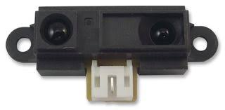

# Lucas Taraire

## Table des Matières
1. [Introduction](#introduction)
2. [Description du Robot](#description-du-robot)
3. [Algorithme de Trémaux](#algorithme-de-trémaux)
4. [Comparaison avec d'Autres Algorithmes](#comparaison-avec-dautres-algorithmes)
5. [Défis et Solutions](#défis-et-solutions)
6. [Applications Potentielles](#applications-potentielles)
7. [Collaboration avec les Pompiers de Paris](#collaboration-avec-les-pompiers-de-paris)
8. [Futurs Développements](#futurs-développements)
9. [Conclusion](#conclusion)
10. [Annexes](#annexes)
    - [Justification des Choix de Composants](#justification-des-choix-de-composants)
    - [Notice d'Utilisation](#notice-dutilisation)
    - [Fiche Technique (Datasheet)](#fiche-technique-datasheet)
    - [Liste des Ressources](#liste-des-ressources)
    - [Montage](#montage)

## Introduction
Bienvenue dans la documentation du robot Maze Mouse, conçu pour naviguer de manière autonome dans des environnements complexes grâce à l'algorithme de Trémaux. Ce document fournit une vue d'ensemble détaillée des caractéristiques, de l'algorithme utilisé, des défis rencontrés, et des applications potentielles du Maze Mouse.

## Description du Robot
Le Maze Mouse est un robot autonome équipé de l'ESP32, de capteurs infrarouges et de roues codeuses, lui permettant de naviguer avec précision dans des labyrinthes et des environnements inconnus.

**Photos et diagrammes :**
- [ ] Ajouter des photos du robot Maze Mouse
- 

## Algorithme de Trémaux
L'algorithme de Trémaux permet au Maze Mouse de marquer les chemins parcourus et de trouver systématiquement la sortie d'un labyrinthe. Ce système de marquage évite les impasses et optimise la navigation.

**Explication de l'algorithme** :
Pour comprendre comment l'algorithme de Trémaux fonctionne, voici une explication détaillée de chaque étape :

1. **Initialisation** : Le robot Maze Mouse commence par marquer son point de départ et initialise toutes les structures de données nécessaires. La position actuelle du robot est définie comme le point de départ.

2. **Scanner les directions possibles** : Le robot examine toutes les directions possibles (Nord, Sud, Est, Ouest) et exclut celles qui sont bloquées par des murs ou des obstacles.

3. **Choisir une direction** :
   - Si le robot trouve une direction qui n'a pas encore été marquée, il choisit cette direction pour avancer.
   - Si toutes les directions possibles ont déjà été visitées au moins une fois, il choisit une direction marquée une seule fois.
   - Si toutes les directions sont marquées deux fois, cela signifie que le robot est revenu à un point déjà exploré, il doit donc revenir sur ses pas et choisir une autre direction.

4. **Avancer** : Le robot avance dans la direction choisie, met à jour sa position actuelle, et marque la nouvelle position pour indiquer qu'il est passé par là.

5. **Vérifier la fin du labyrinthe** : À chaque nouvelle position, le robot vérifie s'il a atteint la sortie du labyrinthe. Si oui, l'algorithme se termine avec succès. Sinon, le robot retourne à l'étape de scanner les directions possibles et répète le processus.

### Diagrammes :
- [ ] Ajouter un diagramme expliquant l'algorithme de Trémaux

## Comparaison avec d'Autres Algorithmes
Le Maze Mouse utilise l'algorithme de Trémaux, qui se distingue par sa fiabilité par rapport aux autres méthodes comme le Random Mouse Algorithm, le Wall Follower Algorithm, le Pledge Algorithm, et le Dead-End Filling Algorithm.

**Tableau de comparaison :**
### Comparaison avec d'Autres Algorithmes

| Algorithme                 | Principe                               | Avantages                                               | Inconvénients                                          |
|----------------------------|----------------------------------------|---------------------------------------------------------|-------------------------------------------------------|
| **Algorithme de Trémaux**  | Marquage des chemins parcourus         | Systématique, évite les impasses, garantie de succès    | Peut être lent dans les labyrinthes très complexes    |
| **Random Mouse Algorithm** | Déplacement aléatoire                  | Facile à implémenter                                    | Inefficace, long à trouver la sortie, non garanti     |
| **Wall Follower Algorithm**| Suivre une paroi (gauche ou droite)    | Simple, fonctionne dans les labyrinthes simples         | Échoue dans les labyrinthes avec boucles complexes    |
| **Pledge Algorithm**       | Suivre une paroi et compter les rotations| Capable de sortir des boucles                          | Complexe, peut échouer dans des labyrinthes complexes |
| **Dead-End Filling Algorithm** | Marquage et évitement des impasses | Efficace dans les labyrinthes connus ou simples         | Nécessite une connaissance préalable ou des capteurs avancés, peut échouer avec de nombreuses boucles |

### Explication des Algorithmes

- **Algorithme de Trémaux** : Cet algorithme marque les chemins parcourus et évite les impasses en revenant sur ses pas. Il est systématique et garantit de trouver la sortie s'il en existe une. Cependant, il peut être lent dans les labyrinthes très complexes où de nombreux chemins doivent être explorés.
- **Random Mouse Algorithm** : Cet algorithme se déplace de manière aléatoire dans le labyrinthe. Bien qu'il soit facile à implémenter, il est généralement inefficace et peut prendre beaucoup de temps pour trouver la sortie, avec aucune garantie de succès.
- **Wall Follower Algorithm** : Cet algorithme consiste à suivre continuellement une paroi (à gauche ou à droite). Il est simple et fonctionne bien dans les labyrinthes simples, mais il échoue souvent dans les labyrinthes avec des boucles complexes ou sans chemin direct à la sortie.
- **Pledge Algorithm** : Cette méthode améliore le Wall Follower en comptant les rotations pour échapper aux boucles. Bien qu'il soit capable de sortir des boucles, il reste complexe et peut échouer dans des labyrinthes très complexes.
- **Dead-End Filling Algorithm** : Cet algorithme marque les impasses pour les éviter à l'avenir. Il est efficace dans les labyrinthes connus ou simples, mais nécessite une connaissance préalable du labyrinthe ou des capteurs avancés pour détecter les impasses. Il peut se comporter de manière inefficace dans les labyrinthes avec de nombreuses boucles.

Ce tableau et ces explications fournissent une vue d'ensemble des différents algorithmes de résolution de labyrinthes, mettant en évidence les avantages et les inconvénients de chacun.

## Défis et Solutions

Le développement du Maze Mouse a rencontré plusieurs défis, notamment l'adaptation de l'algorithme de Trémaux à un environnement réel. Actuellement, nous n'avons pas encore réussi à faire fonctionner pleinement l'algorithme sur notre simulateur. Nous continuons à tester et itérer pour surmonter ces obstacles.

### Problème de l'Îlot
Un des principaux défis rencontrés est le problème de l'îlot. Lorsqu'un robot navigue dans un labyrinthe complexe, il peut arriver qu'il se retrouve à tourner en rond dans une petite zone sans trouver de sortie, formant ainsi un îlot. Ce problème survient généralement dans les labyrinthes avec de nombreux chemins bifurquant vers des impasses.

#### Explication du Problème
- **Description** : Le robot, en suivant l'algorithme de Trémaux, marque les chemins parcourus. Cependant, dans un environnement très complexe avec de multiples bifurcations et impasses proches, il peut finir par revisiter les mêmes zones à plusieurs reprises, créant un îlot de chemins marqués.
- **Conséquence** : Le robot perd du temps en explorant continuellement les mêmes chemins, ce qui réduit l'efficacité de l'algorithme et prolonge le temps nécessaire pour trouver la sortie.

#### Solution Proposée
- **Optimisation de l'Algorithme** : Une solution pour surmonter ce défi consiste à améliorer l'algorithme de Trémaux en intégrant une mémoire temporaire des chemins récemment visités et en ajoutant une condition pour éviter les retours trop fréquents à ces zones. Une autre approche pourrait être d'implémenter une heuristique de "distance minimale" qui guide le robot vers des chemins moins explorés.
- **Simulation et Tests** : Nous continuons à tester cette optimisation dans notre simulateur pour valider son efficacité avant de l'implémenter sur le robot physique.

**Photos et explications :**
- 
  - **Description** : Interface de simulation montrant les chemins marqués par le robot, illustrant le problème de l'îlot.

### Problème de la Précision des Capteurs
Un autre défi rencontré est lié à la précision des capteurs infrarouges. Les capteurs IR utilisés pour détecter les murs et obstacles peuvent parfois fournir des lectures imprécises en raison de reflets ou d'interférences, ce qui peut affecter la navigation du robot.

#### Explication du Problème
- **Description** : Les capteurs IR peuvent être influencés par des surfaces réfléchissantes ou des variations de luminosité, entraînant des erreurs dans les mesures de distance. Ces erreurs peuvent conduire le robot à interpréter incorrectement la présence de murs ou d'obstacles.
- **Conséquence** : Des lectures imprécises peuvent faire dévier le robot de son chemin prévu, causant des collisions ou des mouvements inefficaces, ce qui compromet la performance de l'algorithme de navigation.

#### Solution Proposée
- **Calibration et Filtrage** : Pour atténuer ce problème, nous avons mis en place un processus de calibration régulière des capteurs IR pour ajuster leurs sensibilités. De plus, nous avons intégré un filtrage logiciel pour lisser les valeurs des capteurs et réduire l'impact des lectures erronées.
- **Utilisation de Capteurs Additionnels** : En complément, nous envisageons d'ajouter d'autres types de capteurs, tels que des capteurs à ultrasons, pour obtenir des mesures redondantes et augmenter la fiabilité de la détection des obstacles.

**Photos et explications :**
- 
  - **Description** : Cette photo montre les capteurs infrarouges utilisés sur le robot, avec des annotations indiquant les points de calibration.
- 
  - **Description** : Interface de calibration utilisée pour ajuster les paramètres des capteurs IR et améliorer leur précision.

En résolvant ces défis, nous visons à améliorer significativement les performances du Maze Mouse dans des environnements réels et complexes, assurant ainsi une navigation plus fiable et efficace.

## Applications Potentielles
Le Maze Mouse peut être utilisé dans des scénarios de recherche et sauvetage, de surveillance de sécurité, d'inspection industrielle, et dans l'éducation pour enseigner la programmation et la robotique.

## Collaboration avec les Pompiers de Paris
Nous avons entamé des discussions avec les pompiers de Paris pour tester le Maze Mouse dans des simulations d'incendie. Cette collaboration vise à évaluer et adapter le robot pour des interventions en situation d'urgence.

## Futurs Développements
Nous prévoyons d'intégrer l'intelligence artificielle pour améliorer la capacité du robot à apprendre et s'adapter en temps réel, ainsi que de miniaturiser encore plus le robot pour accéder à des espaces confinés.

## Conclusion
Le robot Maze Mouse et son algorithme de Trémaux ont prouvé leur valeur dans des simulations pratiques. Nous croyons fermement que cette technologie aura un impact significatif dans de nombreux domaines.

## Annexes

### Justification des Choix de Composants

Pour le projet Maze Mouse, chaque composant a été sélectionné en fonction de ses caractéristiques spécifiques, afin d'assurer une performance optimale du robot dans les environnements de labyrinthe. Voici une justification détaillée des choix de composants :

#### 1. Microcontrôleur : ESP32
- **Puissance de traitement** : L'ESP32 est un microcontrôleur puissant doté de deux cœurs de processeur, ce qui permet de traiter rapidement les données des capteurs et d'exécuter des algorithmes complexes comme celui de Trémaux en temps réel.
- **Connectivité** : Il offre une connectivité Wi-Fi et Bluetooth intégrée, facilitant la communication sans fil pour la télémétrie et le contrôle à distance.
- **Ports GPIO** : L'ESP32 possède de nombreux ports GPIO, essentiels pour connecter plusieurs capteurs et actuateurs.
- **Consommation d'énergie** : Il est relativement économe en énergie, ce qui est crucial pour une autonomie prolongée du robot.

**Photo :**
- 

#### 2. Capteur de Distance IR : Sharp GP2Y0A21YK0F
- **Précision** : Ce capteur offre une mesure de distance précise de 10 cm à 80 cm, ce qui est idéal pour détecter la proximité des murs et obstacles dans un labyrinthe.
- **Facilité d'intégration** : La sortie analogique du capteur est facile à lire avec l'ESP32, permettant une intégration simple et efficace.
- **Fiabilité** : Les capteurs Sharp sont connus pour leur fiabilité et leur performance stable dans diverses conditions d'éclairage.

**Photo :**
- 

#### 3. Module de Contrôle de Moteur : L298N
- **Capacité de courant** : Le L298N peut contrôler des moteurs avec un courant jusqu'à 2A par canal, permettant de gérer les moteurs de manière efficace.
- **Contrôle bidirectionnel** : Il offre la possibilité de contrôler la direction de rotation des moteurs, essentielle pour les manœuvres dans le labyrinthe.
- **Protection thermique** : Le L298N est équipé de protections contre la surchauffe et les courts-circuits, assurant une longue durée de vie et une sécurité accrue pour les composants du robot.

**Photo :**
- 

**Diagrammes :**
- 
- 
- 

Ces choix de composants permettent au Maze Mouse d'être un robot efficace, précis et adaptable, capable de relever les défis posés par les labyrinthes complexes et d'autres environnements dynamiques.

### Notice d'Utilisation
1. **Introduction**
   - Présentation du Maze Mouse et de son utilisation prévue.

2. **Installation**
   - Instructions pour assembler le robot.
   - Configuration initiale et mise en route.

3. **Utilisation**
   - Comment démarrer et arrêter le robot.
   - Explications sur les modes de fonctionnement.

4. **Entretien**
   - Guide d'entretien régulier et dépannage.

5. **Sécurité**
   - Consignes de sécurité à suivre lors de l'utilisation du robot.

### Fiche Technique (Datasheet)
#### Caractéristiques Générales
- **Nom du produit**: Maze Mouse
- **Dimensions**: 150 mm x 120 mm x 100 mm
- **Poids**: 500 g
- **Matériaux**: Plastique PLA

#### Spécifications Techniques
##### Microcontrôleur
- **Modèle**: ESP32
- **Fréquence du processeur**: 240 MHz
- **Mémoire RAM**: 520 KB
- **Mémoire flash**: 4 MB

##### Capteurs
- **Capteurs infrarouges**
  - **Type**: Sharp GP2Y0A21YK0F
  - **Plage de détection**: 10-80 cm
  - **Angle de détection**: 30°
- **Roues codeuses**
  - **Résolution**: 20 impulsions par rotation
  - **Diamètre des roues**: 50 mm

#### Alimentation
- **Type d'alimentation**: Batteries Li-Po rechargeables
- **Capacité**: 2200 mAh
- **Tension**: 7.4V
- **Autonomie**: 2 heures en fonctionnement continu

#### Performances
- **Vitesse de déplacement**: 0.3 m/s (max)
- **Précision de navigation**: ±1 mm

#### Logiciel
- **Algorithme utilisé**: Algorithme de Trémaux
- **Langages de programmation**: Python, C++
- **Environnement de développement**: Arduino IDE, PycharmPro

#### Conditions d'Utilisation
- **Température de fonctionnement**: 0°C à 40°C
- **Humidité**: 10% à 90% sans condensation
- **Environnements adaptés**: Intérieurs, Labyrinthes, Zones de test contrôlées

#### Accessoires
- **Inclus**:
  - Câble USB de programmation
  - Manuel d'utilisation
- **Optionnels**:
  - Kit de capteurs supplémentaires
  - Boîtier de protection
  - Modules de communication sans fil (Wi-Fi, Bluetooth)

#### Connectivité
- **Interfaces de communication**:
  - Wi-Fi: 802.11 b/g/n
  - UART, SPI, I2C

## Liste des Ressources pour le Projet Robot Labyrinthe

### Logiciels

- **Fusion 360**: Conception mécanique
- **MMS Simulator (GitHub)**: Simulation du comportement du robot
- **Miro et Notion**: Gestion de projet et documentation
- **Microsoft Teams**: Communication de l'équipe
- **Thonny**: Programmation en Python et MicroPython
- **Word**
- **Firefox et Google**: Recherche d’informations

### Fournisseurs

- **Commande à YNOV via Robert**: Composants
- **Amazon et AliExpress**: Composants et matériaux supplémentaires

### Matériel Informatique et Instruments

- **PC avec second écran (optionnel)**: Conception et programmation
- **Oscilloscope, Générateur, Multimètre**: Test et mesure des circuits
- **Câble USB pour ESP32**: Programmation du robot
- **Souris et Clavier**

### Électroniques

- **ESP32**: Contrôle et connectivité du robot
- **Pont en H L298N**

### Batteries et Chargeurs

- **3 x Batteries LiPo 3.7V 2000mAh (modèle 302020)**: Alimentation du robot
- **Chargeur de batterie LiPo**: Rechargement des batteries

### Visserie et Matériaux d'Assemblage

- **Pack de vis M3/M4/M5/M6 à tête creuse, colle chaude**: Assemblage des composants
- **Rislan (colliers de serrage)**: Gestion des câbles
- **Vis à bois tête fraisée D4*30**

### Machines et Équipement de Fabrication

- **Imprimantes 3D (Bambu Lab Carbon X1, Artillery Sidewinder X1, Creality CR-10)**
- **Filament PLA**: Impressions 3D

### Protection et Sécurité

- **Gaines thermo-rétractables**: Protection des connexions électriques
- **Lunettes de protection, gants anti-coupure**: Sécurité personnelle

### Outils

- **Pince coupante, tournevis (plus kit d'embouts), clé plate, cutter, ébavureur, spatule, pince de serrage, pince plate, pince à dénuder**: Assemblage et maintenance
- **Règle et pied à coulisse**
- **Visseuse électrique**
- **Scie-sauteuse**
- **Serre-joint**

### Moteurs et Capteurs

- **Capteurs infrarouges Sharp GP2Y0A21YK0F**: Navigation et détection
- **Moteur DC 12V 251RPM avec Encodeur**
- **2 x roue DollaTek**

### Stockage

- **Armoire de rangement**: Stockage physique des composants et outils
- **Stockage numérique**: Utilisation du PC local et de GitHub pour versionnage et stockage

### Documentation Technique

- **Fiches techniques pour chaque composant**: Référencement et dépannage

### Labyrinthe

- **Panneau de contreplaqué p. bricolage 300x200x4 mm**

### Montage

1. **Visser la bille** :
   - Fixez la bille à la base du robot pour permettre une mobilité fluide.
   - 

2. **Visser le L298N** :
   - Fixez le module de contrôle de moteur L298N à l'emplacement prévu sur la base du robot.
   - 

3. **Visser les capteurs Sharp** :
   - Installez les trois capteurs infrarouges Sharp GP2Y0A21YK0F aux positions désignées à l'avant du robot pour une détection optimale.
   - 

4. **Monter les moteurs** :
   - Placez les moteurs dans leurs emplacements respectifs et fixez-les avec de la colle chaude pour assurer leur stabilité.
   - 

5. **Monter les pneus sur les roues** :
   - Assemblez les pneus sur les roues pour préparer les unités de propulsion du robot.
   - 

6. **Mettre les roues sur les axes** :
   - Fixez les roues montées sur les axes des moteurs pour permettre la mobilité du robot.
   - 

7. **Câbler les composants** :
   - Connectez les composants entre eux selon le schéma électrique fourni. Assurez-vous que toutes les connexions sont sécurisées et correctes.
   - 

Assurez-vous de vérifier chaque étape après l'assemblage pour garantir que toutes les connexions sont correctement effectuées et que tous les composants sont solidement fixés.
